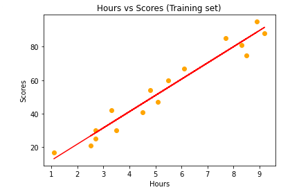
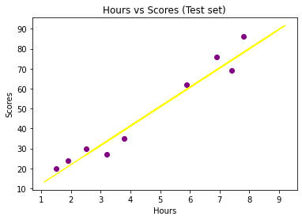
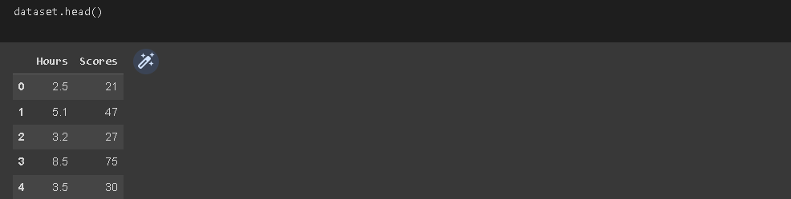
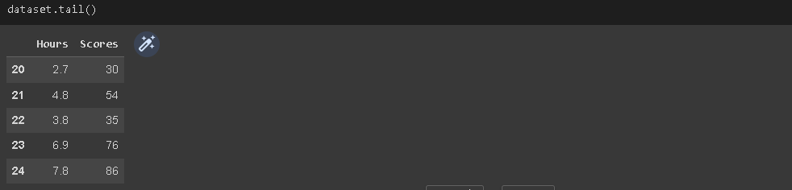
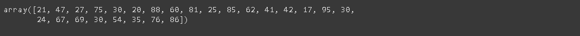
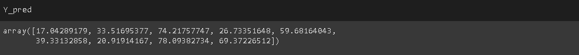
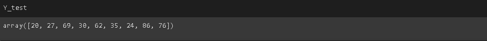

# Implementation-of-Simple-Linear-Regression-Model-for-Predicting-the-Marks-Scored

## AIM:
To write a program to predict the marks scored by a student using the simple linear regression model.

## Equipments Required:
1. Hardware – PCs
2. Anaconda – Python 3.7 Installation / Jupyter notebook

## Algorithm
1.Use the standard libraries in python for Gradient Design.

2.Set variables for assigning dataset values.

3.Import LinearRegression from the sklearn.

4.Assign the points for representing the graph.

5.Predict the regression for marks by using the representation of graph.

6.Compare the graphs and hence we obtain the Linear Regression for the given dataset.


## Program:
```
/*
Program to implement the simple linear regression model for predicting the marks scored.
Developed by: HEMANTH KUMARB
RegisterNumber:  212220040047
*/
import numpy as np
import pandas as pd
import matplotlib.pyplot as plt
dataset = pd.read_csv('/content/student_scores.csv')

dataset.head()
dataset.tail()

#assigning hours to X & scores to Y
X = dataset.iloc[:,:-1].values
X
Y = dataset.iloc[:,1].values
Y

from sklearn.model_selection import train_test_split
X_train,X_test,Y_train,Y_test = train_test_split(X,Y,test_size=1/3,random_state=0)

from sklearn.linear_model import LinearRegression
reg=LinearRegression()
reg.fit(X_train,Y_train)

Y_pred = reg.predict(X_test)
Y_pred

Y_test

plt.scatter(X_train,Y_train,color="green")
plt.plot(X_train,reg.predict(X_train),color="red")
plt.title('Training set(H vs S)')
plt.xlabel("Hours")
plt.ylabel("Scores")
plt.show()

plt.scatter(X_test,Y_test,color="blue")
plt.plot(X_test,reg.predict(X_test),color="silver")
plt.title('Test set(H vs S)')
plt.xlabel("Hours")
plt.ylabel("Scores")
plt.show()

mse = mean_squared_error(Y_test,Y_pred)
print('MSE = ',mse)

mae = mean_absolute_error(Y_test,Y_pred)
print('MAE = ',mae)

rmse=np.sqrt(mse)
print("RMSE = ",rmse)


```
## Output:











## Result:
Thus the program to implement the simple linear regression model for predicting the marks scored is written and verified using python programming.


[def]: folder\196493624-19a2a8de-cb33-4c49-9227-6abe3938cfe2.png
